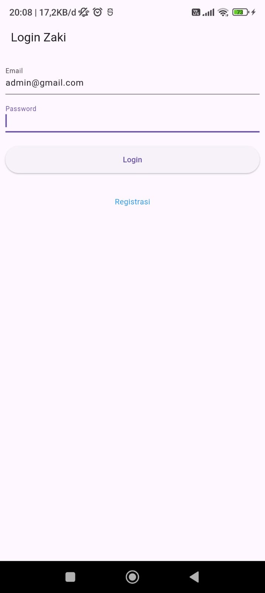

# tokokita

Proyek ini adalah aplikasi Flutter sederhana untuk memenuhi tugas praktikum Pemrograman Mobile Shift E. Aplikasi ini memiliki fitur login, registrasi, dan pengelolaan produk (CRUD).

**Identitas:**  
Nama: Muhammad Zaki Dzulfikar  
NIM: H1D023065  
Shift: E (Lama)/B (Baru)  

---

## Screenshot dan Penjelasan

### 1. Halaman Login
  
Halaman ini digunakan untuk login ke aplikasi. Terdapat dua input: email dan password. Setelah validasi berhasil, pengguna diarahkan ke halaman daftar produk.

### 2. Halaman Registrasi
  
Halaman ini digunakan untuk registrasi pengguna baru. Terdapat empat input: nama, email, password, dan konfirmasi password. Validasi dilakukan untuk memastikan data yang dimasukkan sesuai.

### 3. Halaman Daftar Produk
  
Halaman ini menampilkan daftar produk yang tersedia. Pengguna dapat menambah produk baru dengan menekan tombol "+" di pojok kanan atas. Setiap produk dapat dilihat detailnya dengan menekan item produk.

### 4. Halaman Form Produk
  
Halaman ini digunakan untuk menambah atau mengubah produk. Terdapat tiga input: kode produk, nama produk, dan harga. Setelah data disimpan, produk akan ditambahkan atau diperbarui di daftar produk.

### 5. Halaman Detail Produk
  
Halaman ini menampilkan detail produk seperti kode, nama, dan harga. Terdapat dua tombol: "EDIT" untuk mengubah produk dan "DELETE" untuk menghapus produk.

---

## Penjelasan Kode

### 1. Halaman Login (`lib/ui/login_page.dart`)
- **Fungsi:** Form login dengan validasi email dan password.
- **Navigasi:** Setelah login berhasil, pengguna diarahkan ke halaman daftar produk (`ProdukPage`).
- **Komponen Utama:** 
  - TextFormField untuk email dan password.
  - Tombol "Login" dengan progress indicator.
  - Link ke halaman registrasi (`RegistrasiPage`).

### 2. Halaman Registrasi (`lib/ui/registrasi_page.dart`)
- **Fungsi:** Form registrasi pengguna baru.
- **Validasi:** 
  - Nama minimal 3 karakter.
  - Email harus valid (regex).
  - Password minimal 6 karakter dan konfirmasi harus sama.
- **Komponen Utama:** 
  - TextFormField untuk nama, email, password, dan konfirmasi password.
  - Tombol "Registrasi" dengan progress indicator.

### 3. Halaman Daftar Produk (`lib/ui/produk_page.dart`)
- **Fungsi:** Menampilkan daftar produk.
- **Navigasi:** 
  - Tombol "+" membuka halaman form produk (`ProdukForm`) untuk menambah produk.
  - Tap pada item produk membuka halaman detail produk (`ProdukDetail`).
- **Komponen Utama:** 
  - ListView untuk menampilkan daftar produk.
  - Drawer sederhana dengan opsi logout (belum diimplementasikan).

### 4. Halaman Form Produk (`lib/ui/produk_form.dart`)
- **Fungsi:** Form untuk menambah atau mengubah produk.
- **Validasi:** 
  - Semua field wajib diisi.
  - Harga harus berupa angka.
- **Komponen Utama:** 
  - TextFormField untuk kode produk, nama produk, dan harga.
  - Tombol "Simpan/Ubah" dengan progress indicator.

### 5. Halaman Detail Produk (`lib/ui/produk_detail.dart`)
- **Fungsi:** Menampilkan detail produk.
- **Navigasi:** 
  - Tombol "EDIT" membuka halaman form produk (`ProdukForm`) untuk mengubah produk.
  - Tombol "DELETE" menampilkan dialog konfirmasi untuk menghapus produk.
- **Komponen Utama:** 
  - Text untuk detail produk (kode, nama, harga).
  - Tombol "EDIT" dan "DELETE".

---

## Cara Menjalankan
1. Pastikan Flutter sudah terinstall.
2. Jalankan perintah berikut di terminal:
   ```bash
   flutter pub get
   flutter run