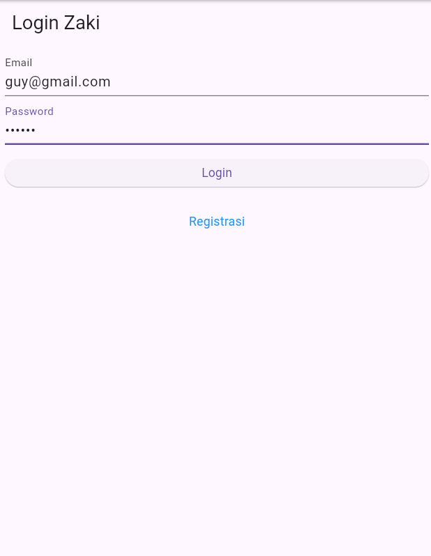
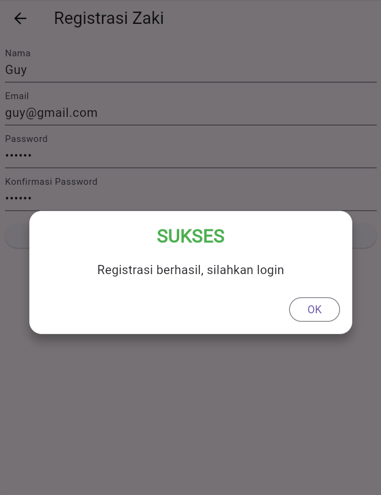
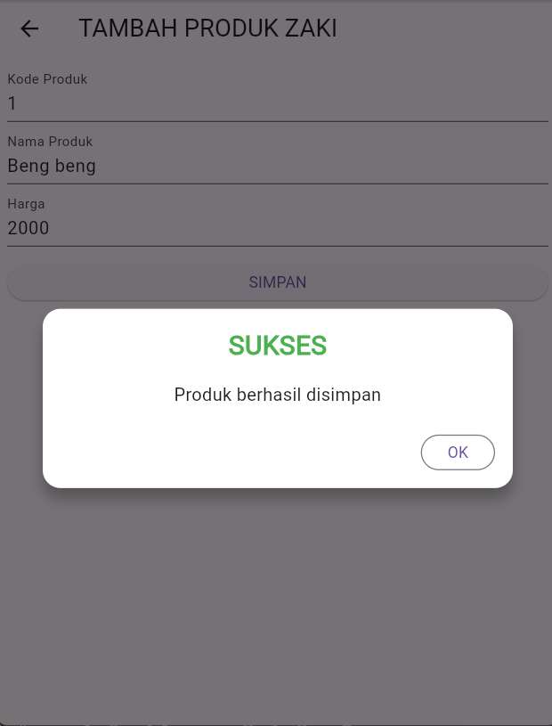
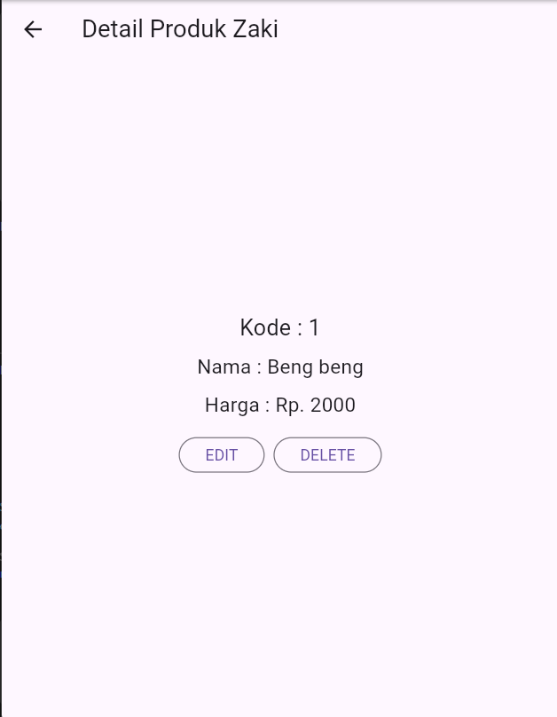
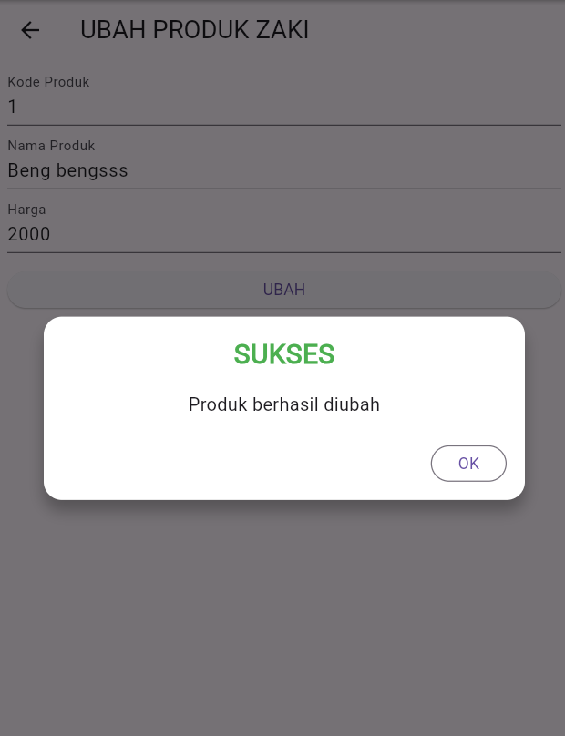
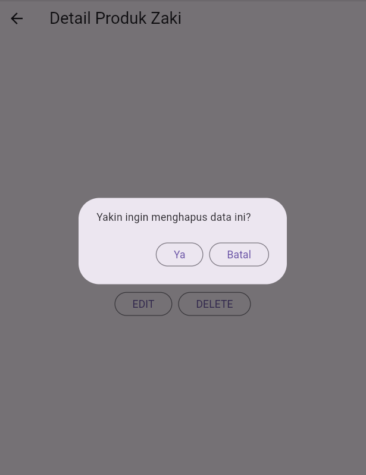

# tokokita

Aplikasi Flutter sederhana untuk memenuhi tugas praktikum Pemrograman Mobile Shift E.  
Fitur utama: **Login, Registrasi, dan CRUD Produk** terhubung ke REST API CodeIgniter 4.

**Identitas:**  
Nama: Muhammad Zaki Dzulfikar  
NIM: H1D023065  
Shift: E (KRS)/B(Sekarang)

---

## Daftar Isi

1. [Screenshot & Penjelasan Proses](#screenshot--penjelasan-proses)
    - Proses Login
    - Proses Registrasi
    - Proses Tambah Produk
    - Proses Lihat Detail Produk
    - Proses Edit Produk
    - Proses Hapus Produk
2. [Penjelasan Kode](#penjelasan-kode)
3. [Cara Menjalankan](#cara-menjalankan)
4. [Struktur Proyek](#struktur-proyek)

---

## Screenshot & Penjelasan Proses

### 1. Proses Login

#### a. Form Login
  
Pengguna mengisi email dan password, lalu klik tombol **Login**.

#### b. Popup Berhasil/Gagal
Jika login berhasil, pengguna diarahkan ke halaman produk.  
Jika gagal, muncul popup seperti berikut:


**Kode Validasi Login:**
```dart
LoginBloc.login(
  email: _emailTextboxController.text,
  password: _passwordTextboxController.text,
).then((value) async {
  if (value.code == 200) {
    // Simpan token, pindah ke ProdukPage
  } else {
    // Tampilkan WarningDialog
  }
}, onError: (error) {
  // Tampilkan WarningDialog
});
```

---

### 2. Proses Registrasi

#### a. Form Registrasi
  
Pengguna mengisi nama, email, password, dan konfirmasi password, lalu klik **Registrasi**.

#### b. Popup Berhasil/Gagal
Jika registrasi berhasil, muncul popup sukses.  
Jika gagal, muncul popup error dengan pesan detail.


**Kode Validasi Registrasi:**
```dart
RegistrasiBloc.registrasi(
  nama: _namaTextboxController.text,
  email: _emailTextboxController.text,
  password: _passwordTextboxController.text,
).then((value) {
  // Tampilkan SuccessDialog
}, onError: (error) {
  // Tampilkan WarningDialog + log error
});
```

---

### 3. Proses Tambah Data Produk

#### a. Form Tambah Produk
  
Pengguna mengisi kode produk, nama produk, dan harga, lalu klik **Simpan**.

#### b. Popup Berhasil/Gagal
Jika berhasil, produk ditambahkan ke list dan muncul popup sukses.  
Jika gagal, muncul popup error.

**Kode Tambah Produk:**
```dart
Produk createProduk = Produk(
  kodeProduk: _kodeProdukTextboxController.text,
  namaProduk: _namaProdukTextboxController.text,
  hargaProduk: double.parse(_hargaProdukTextboxController.text),
);

ProdukBloc.addProduk(produk: createProduk).then((value) {
  // Tampilkan SuccessDialog
}, onError: (error) {
  // Tampilkan WarningDialog
});
```

---

### 4. Proses Lihat Detail Produk

#### a. Tampilan Detail Produk
  
Menampilkan kode, nama, dan harga produk. Terdapat tombol **EDIT** dan **DELETE**.

**Kode Navigasi ke Detail:**
```dart
Navigator.push(
  context,
  MaterialPageRoute(builder: (context) => ProdukDetail(produk: produk)),
);
```

---

### 5. Proses Edit Produk

#### a. Form Edit Produk
  
Field otomatis terisi sesuai data produk yang dipilih. Pengguna dapat mengubah data lalu klik **Ubah**.

#### b. Popup Berhasil/Gagal
Jika berhasil, produk diupdate dan muncul popup sukses.  
Jika gagal, muncul popup error.

**Kode Edit Produk:**
```dart
ProdukBloc.updateProduk(produk: updateProduk).then((produkBaru) {
  // Tampilkan SuccessDialog, kembali ke detail dengan produkBaru
}, onError: (error) {
  // Tampilkan WarningDialog
});
```

---

### 6. Proses Hapus Produk

#### a. Konfirmasi Hapus
  
Klik tombol **DELETE** akan memunculkan dialog konfirmasi.

#### b. Popup Berhasil/Gagal
Jika berhasil, produk dihapus dari list dan muncul popup sukses.  
Jika gagal, muncul popup error.

**Kode Hapus Produk:**
```dart
ProdukBloc.deleteProduk(id: produk.id).then((status) {
  if (status) {
    // Tampilkan SuccessDialog
  } else {
    // Tampilkan WarningDialog
  }
}, onError: (error) {
  // Tampilkan WarningDialog
});
```

---

## Penjelasan Kode

### 1. Struktur CRUD di Bloc

- **Tambah Produk:**  
  Kirim data ke API dengan metode POST, parsing response, tampilkan hasil.
- **Lihat Produk:**  
  Ambil list produk dari API dengan GET, parsing ke model Produk.
- **Edit Produk:**  
  Kirim data ke API dengan PUT, parsing response, update tampilan.
- **Hapus Produk:**  
  Kirim request ke API dengan DELETE, parsing response, update list.

### 2. Model Produk
```dart
class Produk {
  String? id;
  String? kodeProduk;
  String? namaProduk;
  double? hargaProduk;
  Produk({this.id, this.kodeProduk, this.namaProduk, this.hargaProduk});
  factory Produk.fromJson(Map<String, dynamic> obj) {
    return Produk(
      id: obj['id'].toString(),
      kodeProduk: obj['kode_produk'],
      namaProduk: obj['nama_produk'],
      hargaProduk: obj['harga'] != null
          ? double.tryParse(obj['harga'].toString()) ?? 0
          : 0,
    );
  }
}
```

### 3. API Helper
```dart
class Api {
  Future<dynamic> post(String url, dynamic data) async { ... }
  Future<dynamic> get(String url) async { ... }
  Future<dynamic> put(String url, dynamic data) async { ... }
  Future<dynamic> delete(String url) async { ... }
}
```

---

## Cara Menjalankan

1. Pastikan Flutter sudah terinstall.
2. Pastikan backend CodeIgniter 4 sudah berjalan dan API bisa diakses.
3. Jalankan perintah berikut di terminal:
   ```bash
   flutter pub get
   flutter run
   ```
4. Untuk Flutter Web, pastikan CORS backend sudah aktif.

---

## Struktur Proyek

```
lib/
├── bloc/
├── helpers/
├── model/
├── ui/
├── widget/
└── main.dart
```

---

## Catatan

- Semua proses CRUD sudah terhubung ke backend dan diuji.
- Jika ada error, cek log backend dan response API.
- Untuk pengembangan lebih lanjut, bisa tambahkan validasi, pagination, dan fitur pencarian produk.

---

**Tugas ini dibuat untuk memenuhi praktikum Pemrograman Mobile Shift E (KRS) Shift B(Sekarang).**